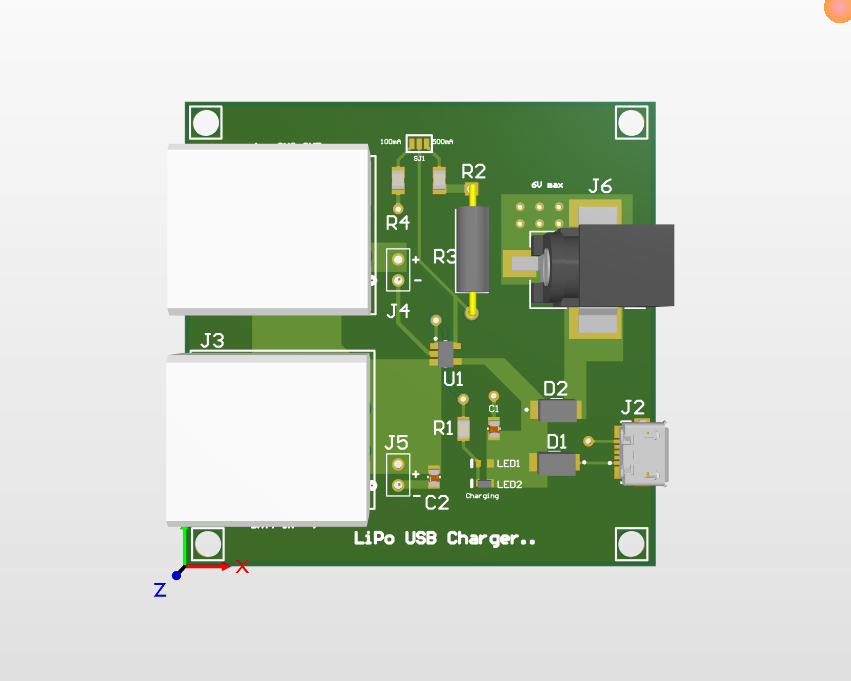

# 🔋 USB LiPo Charger – Single Cell (Learning Project)

This project is a personal learning recreation of SparkFun's [USB LiPoly Charger - Single Cell](https://github.com/sparkfun/USB_LiPolyCharger_SingleCell). The goal was to understand and practice PCB design by recreating a working lithium polymer battery charging circuit.

---

## 📘 Project Summary

- Charges 3.7V LiPo cells via USB input
- Features: JST connectors, barrel jack input, and onboard USB
- Built using Altium for schematic and layout practice

---

## 📁 Contents

- `Altium_Files/` – Schematic and PCB design files
- `Image/` – 3D view only
- `Other_Files/` – contains components list , schm and pcb pdf files
- `Output_Files/` – Gerbers, BOM, and production-ready files

---

## 🔋 USB LiPo Charger – Single Cell (Learning Project)

## 🧠 Credits & License

This project is a **recreation** for educational purposes based on open hardware designs by [SparkFun Electronics](https://www.sparkfun.com/).  
Original project: [USB_LiPolyCharger_SingleCell](https://github.com/sparkfun/USB_LiPolyCharger_SingleCell)

Original design and documentation licensed under the **SparkFun License** (Creative Commons Attribution ShareAlike 4.0 - CC BY-SA 4.0).

I sincerely thank SparkFun for sharing their work and enabling open hardware learning.

---

## 🔗 License

This project is released under the same license as the original:

**Creative Commons Attribution Share-Alike 4.0 International**  
More info: [https://creativecommons.org/licenses/by-sa/4.0/](https://creativecommons.org/licenses/by-sa/4.0/)
